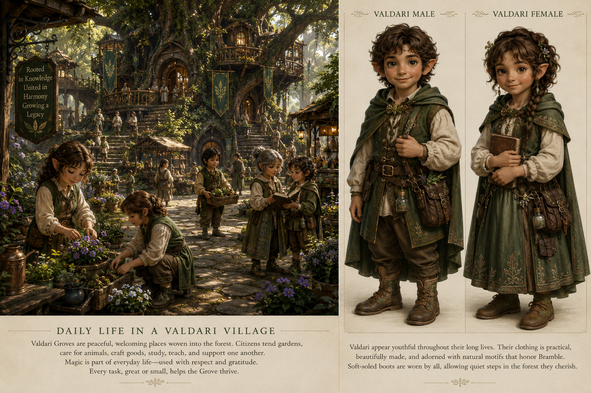

# Valdari

The Valdari are a small-statured forest people of Elarindor, known for their ancient traditions, sharp intellects, and deep connection to living magic.

*AI-generated concept art. Visual reference only; not final or canonical artwork.*

## Articles

- [Culture](culture.md)
- [Architecture](architecture.md)
- [Settlements](settlements.md)
- [Appearance](appearance.md)
